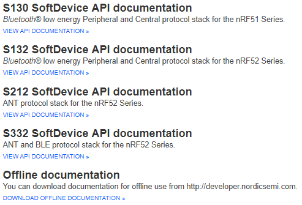
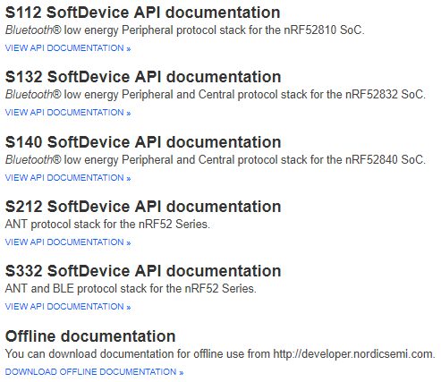

# Nordic Semiconductor Tutorial

**Please Read Carefully Product Specification, SoftDevice Specification AND SDK Document.**

    like:
    nRF52832 - CPU
    The ARM® Cortex®-M4 processor with floating-point unit (FPU) has a 32-bit instruction set (Thumb®-2
    technology) that implements a superset of 16 and 32-bit instructions to maximize code density and
    performance.
    The CPU clock speed is 64 MHz. The nRF52832 contains Flash and RAM that can be used for code and data storage.

# The [Nordic Semiconductor Infocenter](https://infocenter.nordicsemi.com) contains technical documentation for our current solutions and technologies.

# 

# 

# [nRF5_SDK](http://developer.nordicsemi.com/nRF5_SDK/)

[**http://developer.nordicsemi.com/nRF5_SDK/doc/**](http://developer.nordicsemi.com/nRF5_SDK/doc/)

**Pay attention which SoftDevice version is used in each SDK**

**Pay attention the SoftDevice is used for Central or Peripheral protocol stack solution in each SDK**

**Pay attention SoftDevice memory usage in each SDK**

like:

or

## [nRF51 Software Development Kit 6.1.0](http://developer.nordicsemi.com/nRF5_SDK/nRF51_SDK_v6.x.x/doc/6.1.0/)

## [nRF51 Software Development Kit 7.2.0](http://developer.nordicsemi.com/nRF5_SDK/nRF51_SDK_v7.x.x/doc/7.2.0/)

## [nRF51 Software Development Kit 8.1.0](http://developer.nordicsemi.com/nRF5_SDK/nRF51_SDK_v8.x.x/doc/8.1.0/)

## [nRF51 Software Development Kit 9.0.0](http://developer.nordicsemi.com/nRF5_SDK/nRF51_SDK_v9.x.x/doc/9.0.0/)

## [nRF51 Software Development Kit 10.0.0](http://developer.nordicsemi.com/nRF5_SDK/nRF51_SDK_v10.x.x/doc/10.0.0/)

## [nRF5 Software Development Kit v11.0.0](http://developer.nordicsemi.com/nRF5_SDK/nRF5_SDK_v11.x.x/doc/11.0.0/)

## [nRF5 Software Development Kit v12.3.0](http://developer.nordicsemi.com/nRF5_SDK/nRF5_SDK_v12.x.x/doc/12.3.0/)

## [nRF5 Software Development Kit v13.1.0](http://developer.nordicsemi.com/nRF5_SDK/nRF5_SDK_v13.x.x/doc/13.1.0/)

## [nRF5 Software Development Kit v14.2.0](http://developer.nordicsemi.com/nRF5_SDK/nRF5_SDK_v14.x.x/doc/14.2.0/)

## [nRF5 Software Development Kit v15.3.0](http://developer.nordicsemi.com/nRF5_SDK/nRF5_SDK_v15.x.x/doc/15.3.0/)

# [Dual-bank and single-bank updates](http://developer.nordicsemi.com/nRF51_SDK/nRF51_SDK_v8.x.x/doc/8.0.0/s110/html/a00088.html)

To safely perform a Device Firmware Update, the new firmware image should not be copied to the final location in memory until it has been validated. This ensures that only complete and valid images are activated. If an error occurs during the transfer, the firmware should not be updated.

## **Dual-bank updates**

During a dual-bank update, the existing bootloader, SoftDevice, or application is preserved until it is replaced by the new firmware image. The update process differs slightly depending on the type of image that is transferred.

### SoftDevice (with or without bootloader)

DFU flash operations for SoftDevice and bootloader update

### Application or bootloader

DFU flash operations for a dual-bank application update

## **Single-bank updates**

In a single-bank update, the existing application is replaced with the new application during the transfer of the image. Single-bank updates are available only for application updates, because if an error occurs and the device is left without a valid application, you can recover it by uploading a valid application again. If the device is left without a valid bootloader or SoftDevice, you can recover it only by attaching a flash tool and updating the device with a flash programmer.

The following figure shows the DFU process for an application in single-bank mode.

DFU flash operations for a single-bank application update

First, the existing application is erased to prepare for the DFU transfer. The transferred image is then stored at the location of the old application, thus between the current SoftDevice and bootloader. Existing application data can be retained; see Preserving application data for more information. When the transfer is completed, the bootloader will validate the new application. If it is valid, the bootloader will start it. If it is not valid, the bootloader will reset, start in DFU mode, and wait for a new image to be uploaded.
