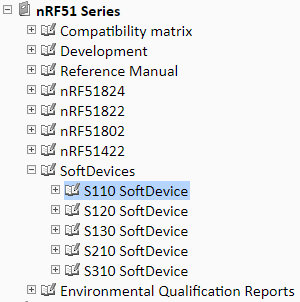

# Nordic Semiconductor Tutorial

**Please Read Carefully Product Specification, SoftDevice Specification AND SDK Document.**

    like:
    nRF52832 - CPU
    The ARM® Cortex®-M4 processor with floating-point unit (FPU) has a 32-bit instruction set (Thumb®-2
    technology) that implements a superset of 16 and 32-bit instructions to maximize code density and
    performance.
    The CPU clock speed is 64 MHz. The nRF52832 contains Flash and RAM that can be used for code and data storage.

# The [Nordic Semiconductor Infocenter](https://infocenter.nordicsemi.com) contains technical documentation for our current solutions and technologies.

# 

# 

# [nRF5_SDK](http://developer.nordicsemi.com/nRF5_SDK/)

[**http://developer.nordicsemi.com/nRF5_SDK/doc/**](http://developer.nordicsemi.com/nRF5_SDK/doc/)

**Pay attention which SoftDevice version is used in each SDK**

**Pay attention the SoftDevice is used for Central or Peripheral protocol stack solution in each SDK**

**Pay attention SoftDevice memory usage in each SDK**

like:

or

## [nRF51 Software Development Kit 6.1.0](http://developer.nordicsemi.com/nRF5_SDK/nRF51_SDK_v6.x.x/doc/6.1.0/)

## [nRF51 Software Development Kit 7.2.0](http://developer.nordicsemi.com/nRF5_SDK/nRF51_SDK_v7.x.x/doc/7.2.0/)

## [nRF51 Software Development Kit 8.1.0](http://developer.nordicsemi.com/nRF5_SDK/nRF51_SDK_v8.x.x/doc/8.1.0/)

## [nRF51 Software Development Kit 9.0.0](http://developer.nordicsemi.com/nRF5_SDK/nRF51_SDK_v9.x.x/doc/9.0.0/)

## [nRF51 Software Development Kit 10.0.0](http://developer.nordicsemi.com/nRF5_SDK/nRF51_SDK_v10.x.x/doc/10.0.0/)

## [nRF5 Software Development Kit v11.0.0](http://developer.nordicsemi.com/nRF5_SDK/nRF5_SDK_v11.x.x/doc/11.0.0/)

## [nRF5 Software Development Kit v12.3.0](http://developer.nordicsemi.com/nRF5_SDK/nRF5_SDK_v12.x.x/doc/12.3.0/)

## [nRF5 Software Development Kit v13.1.0](http://developer.nordicsemi.com/nRF5_SDK/nRF5_SDK_v13.x.x/doc/13.1.0/)

## [nRF5 Software Development Kit v14.2.0](http://developer.nordicsemi.com/nRF5_SDK/nRF5_SDK_v14.x.x/doc/14.2.0/)

## [nRF5 Software Development Kit v15.3.0](http://developer.nordicsemi.com/nRF5_SDK/nRF5_SDK_v15.x.x/doc/15.3.0/)

# [Dual-bank and single-bank updates](http://developer.nordicsemi.com/nRF51_SDK/nRF51_SDK_v8.x.x/doc/8.0.0/s110/html/a00088.html)

To safely perform a Device Firmware Update, the new firmware image should not be copied to the final location in memory until it has been validated. This ensures that only complete and valid images are activated. If an error occurs during the transfer, the firmware should not be updated.

## **Dual-bank updates**

During a dual-bank update, the existing bootloader, SoftDevice, or application is preserved until it is replaced by the new firmware image. The update process differs slightly depending on the type of image that is transferred.

### SoftDevice (with or without bootloader)

DFU flash operations for SoftDevice and bootloader update

### Application or bootloader

DFU flash operations for a dual-bank application update

## **Single-bank updates**

In a single-bank update, the existing application is replaced with the new application during the transfer of the image. Single-bank updates are available only for application updates, because if an error occurs and the device is left without a valid application, you can recover it by uploading a valid application again. If the device is left without a valid bootloader or SoftDevice, you can recover it only by attaching a flash tool and updating the device with a flash programmer.

The following figure shows the DFU process for an application in single-bank mode.

DFU flash operations for a single-bank application update

First, the existing application is erased to prepare for the DFU transfer. The transferred image is then stored at the location of the old application, thus between the current SoftDevice and bootloader. Existing application data can be retained; see Preserving application data for more information. When the transfer is completed, the bootloader will validate the new application. If it is valid, the bootloader will start it. If it is not valid, the bootloader will reset, start in DFU mode, and wait for a new image to be uploaded.

# [External 32.768 kHz *External crystal vs. internal RC oscillator]()

## Choice of 32 kHz clock source

Also, in your design you should consider what low frequency clock source to use. As the nRF51 reference manual states there is a choice of three low frequency clock sources, `external crystal`, `internal RC` and the `synthesized clock`. Using the synthesized clock is of really no use in terms of current consumption since it will require the 16 MHz clock to be constantly enabled. Using a `high accuracy external crystal` is clearly the **best choice** in terms of current consumption.

Another choice is to use the internal 32kHz RC oscillator and calibrate every 4 seconds to maintain accuracy within 250 ppm. A motivation for using the internal 32kHz RC is either to decrease BOM or to save space on PCB. Using internal low frequency 32kHz RC clock instead of 20ppm external crystal will add around 10 uA current consumption compared to 20ppm external crystal. The internal 32kHz RC needs to be calibrated every 4 seconds and obtains frequency tolerance of 250ppm.

* **External crystal :** Using an external 32.768 kHz crystal is the option that gives the lowest current consumption. If you have this on your board, you should use it. You have to choose the appropriate accuracy for your crystal, so that the softdevice can take the accuracy into consideration to know how much the clock may drift over a certain period. It will use this information to make sure it compensates correctly and wakes up the chip just when needed.

* **Internal RC oscillator :** The chip have an internal RC oscillator that has an accuracy of 250 ppm when calibrated. The only thing you can choose through this enum for the RC is the calibration interval. As given in the nRF51822 PS, the accuracy is specified when the temperature is relatively stable, and it is calibrated every 4 seconds, so this is the calibration interval that should be used for most (all?) applications.

* **A synthesized 32.768 kHz clock :** This tells the softdevice to use the 16 MHz clock to synthesize a low-frequency clock. Since the low-frequency clock is used in the sleeping periods between for example conneciton evetns, this means that the 16 MHz must always run, giving a substantial increase in current consumption (most likely mA average current consumption instead of µA).

**Solution ：**

1) If the SDK version is too Low, just look for sofdevice initializing function ` ble_stack_init()` in main.c and Set the Clock source.

    

    * select the NRF_CLOCK_LFCLKSRC_RC_250_PPM_TEMP_4000MS_CALIBRATION option when using the internal RC clock.

    * For using External crystal, select NRF_CLOCK_LFCLKSRC_XTAL_x_PPM. Enums used for this mode with softdevice: NRF_CLOCK_LFCLKSRC_XTAL_x_PPM, where x is the accuracy of your crystal.

2) Or inside sofdevice initializing function ` ble_stack_init()` in main.c Set the `nrf_clock_lf_cfg_t`:

    

    And Set like: 

    ~~~
    #define NRF_CLOCK_LFCLKSRC      {.source        = NRF_CLOCK_LF_SRC_XTAL,            \
                                        .rc_ctiv       = 0,                                \
                                        .rc_temp_ctiv  = 0,                                \
                                        .xtal_accuracy = NRF_CLOCK_LF_XTAL_ACCURACY_20_PPM}
    ~~~

    Also we have to set the foloowing part in `sdk_config.h` :

    

3) For the latest SDK version : 

    

    Open `nrf_sdh.c` :

    

    Also we have to set the foloowing part in `sdk_config.h` :

    

## Estimate battery life

Battery life can be calculated when you know the average current consumption of the device and the energy capacity of your battery. Below are some calculation examples for battery lifetime for batteries with different energy capacity:

    Average current consumption of device: 20 uA
    Energy capacity: 220 mAh (typical CR2032 coin cell battery)
    Battery lifetime: 0,22 Ah / 0,00002 A = 11,000 hours = 458 days

    Average current consumption of device: 100 uA
    Energy capacity: 220 mAh (typical CR2032 coin cell battery)
    Battery lifetime: 0,22 Ah / 0,0001 A = 2,200 hours = 91 days

    Average current consumption of device: 100 uA
    Energy capacity: 1000 mAh
    Battery lifetime: 1 Ah / 0,0001 A = 10,000 hours = 417 days

## Low power mode with BLE softdevice

Most BLE examples in the SDK will include the power_manage call in the main function. This call uses the sd_app_event_wait() softdevice call (or power_manage()) which enables the System On low power mode, which keeps current consumption to a minimum.

To put a device into System Off mode when using the softdevice, call sd_power_system_off() function.

The softdevice uses RTC0 to keep track of time and to know when to wake up for the next BLE connection event. The RTC0 will eventually wake the chip up and the softdevice will carry out the action needed for the BLE connection event, which includes receiving and sending packages. When it is done, execution will continue where it left off in the application after sd_app_event_wait() command. Normally in BLE examples in the SDK, the sd_app_event_wait() command is inside the main loop, therefore code residing in the main loop will execute once and then the sd_app_event_wait() is called again and the chip will sleep again in System On low power mode until the next BLE connection event.

What sd_app_event_wait() actually does is to disable the CPU. All peripherals (e.g. SPI, UART, TIMER, ...) that are enabled before calling sd_app_event_wait() will still be enabled. The CPU will actually wake up on any interrupt, i.e. it will wake up for BLE connection/advertising events, softdevice callbacks or peripheral interrupts (e.g. SPI, UART, TIMER, ... interrupts).

**Conclusion ：**

References:

[How to minimize current consumption for BLE application on nRF51822](https://devzone.nordicsemi.com/f/nordic-q-a/1657/how-to-minimize-current-consumption-for-ble-application-on-nrf51822#5187)

[nRF51 Low power modes and power profiles documentation](res/nRF51 Low power modes and power profiles documentation.html)

[What low-frequency clock sources can I use?](https://devzone.nordicsemi.com/f/nordic-q-a/27004/what-low-frequency-clock-sources-can-i-use)

